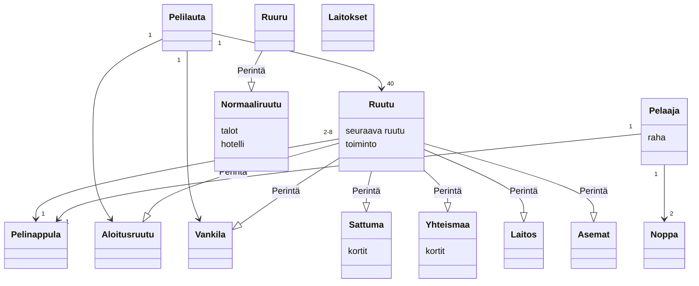

# Monopoli

Things

```mermaid
 classDiagram
      Pelilauta "1" --> "40" Ruutu
      Ruutu "2-8" --> "1" Pelinappula
      Pelaaja "1" --> "1" Pelinappula
      Pelaaja "1" --> "2" Noppa
      Pelilauta "1" --> Aloitusruutu
      Pelilauta "1" --> Vankila

      Ruutu --|> Aloitusruutu : Perintä
      Ruutu --|> Vankila : Perintä
      Ruutu --|> Sattuma : Perintä
      Ruutu --|> Yhteismaa : Perintä
      Ruutu --|> Laitos : Perintä
      Ruutu --|> Asemat : Perintä
      Ruuru --|> Normaaliruutu : Perintä

      class Pelilauta
      class Pelaaja{
          raha
      }
      class Ruutu{
          seuraava ruutu
          toiminto
      }
      class Aloitusruutu
      class Vankila
      class Sattuma{
          kortit
      }
      class Yhteismaa{
          kortit
      }
      class Asemat
      class Laitokset
      class Normaaliruutu{
          talot
          hotelli
      }
```
